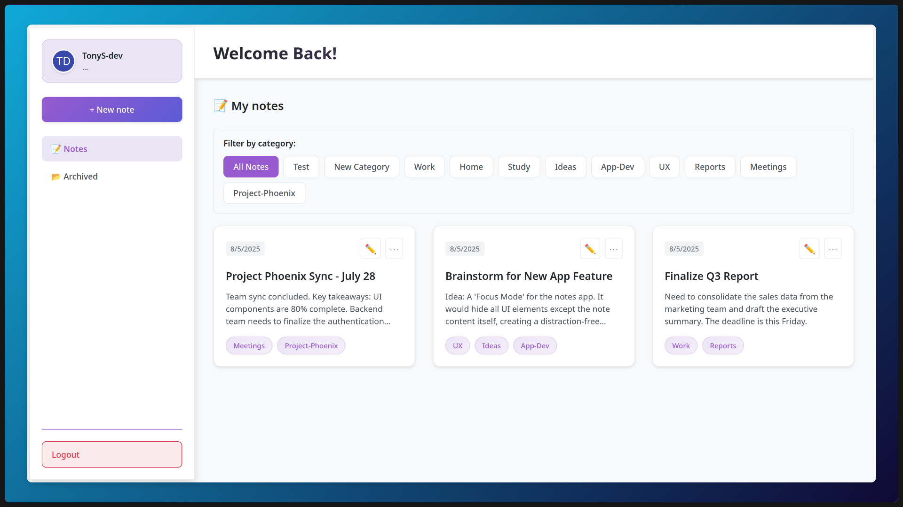

# Notely - Full-Stack Notes Management Application

A modern, full-stack, and containerized web application for note-taking. This project is built with a professional SPA (Single-Page Application) architecture, featuring a React frontend and a NestJS backend, fully orchestrated with Docker.



---

## 🛠️ Tech Stack

### Frontend
-   **React** (`^19.1.0`): Component-based UI library
-   **TypeScript** (`~5.8.3`): Type safety and modern JavaScript features
-   **Vite** (`^7.0.4`): Fast development server and build tool
-   **React Router DOM** (`^7.7.1`): Client-side routing
-   **Axios** (`^1.11.0`): HTTP client for API requests
-   **React Hot Toast** (`^2.5.2`): Toast notifications
-   **JWT Decode** (`^4.0.0`): JWT token decoding

### Backend
-   **NestJS** (`^11.0.1`): Progressive Node.js framework
-   **TypeORM** (`^0.3.25`): Object-relational mapping
-   **PostgreSQL** (`15-alpine`): Relational database
-   **JWT** (`^11.0.0`): JSON Web Token authentication
-   **Passport** (`^0.7.0` + `^4.0.1` + `^1.0.0`): Authentication middleware
-   **bcrypt** (`^6.0.0`): Password hashing
-   **class-validator** (`^0.14.2`): Input validation
-   **class-transformer** (`^0.5.1`): Data transformation

### Testing & Code Quality
-   **Jest** (`^30.0.0`): Testing framework
-   **TypeScript ESLint** (`^8.35.1` frontend / `^8.20.0` backend): TypeScript linting
-   **Prettier** (`^3.4.2`): Code formatting
-   **Supertest** (`^7.0.0`): API testing

### DevOps & Infrastructure
-   **Docker**: Containerization platform
-   **Docker Compose**: Multi-container orchestration
-   **Node.js** (`20-alpine`): JavaScript runtime environment
-   **PostgreSQL** (`15-alpine`): Production database

---

## 📁 Project Structure

```
├── backend/
│   ├── src/
│   │   ├── auth/              # Authentication (JWT, login, guards)
│   │   ├── categories/        # Category management
│   │   ├── common/            # Shared filters, DTOs
│   │   ├── notes/             # Notes CRUD and logic
│   │   ├── users/             # User management
│   │   ├── app.controller.ts  # API status and health endpoints
│   │   ├── app.module.ts      # Main application module
│   │   ├── app.service.ts     # API status logic
│   │   ├── seed.ts            # Database seeder for initial data
│   ├── test/                  # E2E and unit tests
│   ├── .env                   # Backend environment variables
│   ├── Dockerfile             # Backend Dockerfile
│   ├── .dockerignore          # Docker ignore file
│   ├── package.json           # Backend dependencies and scripts
│   ├── README.md              # Backend documentation
│   └── ...
├── frontend/
│   ├── src/
│   │   ├── api/               # API client
│   │   ├── components/        # React components
│   │   ├── context/           # React context providers
│   │   ├── hooks/             # Custom hooks
│   │   ├── pages/             # Page components
│   │   ├── styles/            # CSS styles
│   │   ├── types/             # TypeScript types
│   │   └── main.tsx           # App entry point
│   ├── public/                # Static assets
│   ├── .env                   # Frontend environment variables
│   ├── Dockerfile             # Frontend Dockerfile
│   ├── .dockerignore          # Docker ignore file
│   ├── package.json           # Frontend dependencies and scripts
│   ├── README.md              # Frontend documentation
│   └── ...
├── docker-compose.yml         # Multi-container orchestration
├── .env                       # Root environment variables
├── start.sh                   # Startup script (run all services)
├── stop.sh                    # Stop and clean up all services
└── CHALLENGE.md               # Exercise requirements
```

---

## 🚀 Getting Started

### Prerequisites

Before you begin, ensure you have the following software installed on your system. This project is designed to be run with Docker, which handles all other dependencies.

-   **Docker Engine**: Version `20.10.0` or newer.
-   **Docker Compose**: Version `2.0.0` or newer (this is included with all modern Docker installations).

You can verify your installation by running `docker --version` and `docker compose version`.

➡️ **[Official Docker Installation Guide](https://docs.docker.com/engine/install/)**

### How to Run the Application

Once the prerequisites are met, you can start the entire application stack (Frontend, Backend, and Database) with a single command.

1.  **Clone the repository:**
    ```bash
    git clone git@github.com:hirelens-challenges/Santiago-837721.git
    cd Santiago-837721
    ```
2.  **Make the scripts executable (only needs to be done once):**
    ```bash
    chmod +x start.sh stop.sh
    ```
3.  **Run the script:**
    ```bash
    ./start.sh
    ```
    The script will check for prerequisites, build the necessary Docker images, and start all services. Once it's finished, the application will be available at:
    -   **Frontend**: [http://localhost:5173](http://localhost:5173)
    -   **Backend API**: [http://localhost:3000](http://localhost:3000)

4.  **To stop and clean up the environment:**
    ```bash
    ./stop.sh
    ```
    This will stop all containers, remove volumes, and clean up unused Docker resources.

---

## 🌱 Environment Variables

The project uses environment variables to streamline the process of retrieving base data and to protect sensitive information such as the private key for JWT token generation, database connection details, and other variables reused throughout the project. By using environment variables, these values are centralized, preventing hardcoded data in the codebase. (THEY MUST NOT BE PUSHED TO PRODUCTION)

**Main variables:**
- `DB_HOST`, `DB_PORT`, `DB_USERNAME`, `DB_PASSWORD`, `DB_DATABASE`: Database connection
- `JWT_SECRET`: Secret key for JWT authentication
- `BACKEND_PORT`, `FRONTEND_PORT`: Service ports
- `VITE_API_URL`: Frontend API base URL

Variables are defined in `.env` files at the root, backend, and frontend folders. Docker Compose automatically loads these for each service.

---

## ✅ Core Features

-   **Full JWT Authentication:** Secure user registration and login.
-   **Complete CRUD Operations:** Create, read, update, and delete notes.
-   **Note Management:** Archive, unarchive, and duplicate notes.
-   **Category System:** Organize notes with custom categories.
-   **Protected Routes:** Both client-side and server-side routes are protected based on authentication.
-   **Containerized Environment:** The entire application stack is managed by Docker for consistency and ease of setup.
-   **Responsive UI:** A clean and modern user interface that works on desktop and mobile.

---

## 📝 Challenge Requirements Mapping

- **SPA Architecture:** Frontend and backend are separate apps, each with their own package.json and dependencies.
- **REST API:** Backend exposes a RESTful API for all note, category, and user operations.
- **Layered Backend:** NestJS enforces Controllers, Services, and Repositories/Entities.
- **Database Persistence:** All data is stored in PostgreSQL using TypeORM ORM. No mocks or in-memory storage.
- **Startup Script:** `start.sh` sets up everything, including DB schema and initial data via seeder.
- **Stop Script:** `stop.sh` stops and cleans up all containers and volumes.
- **README:** This file documents all runtimes, engines, tools, and versions required.
- **Default Users:** Documented below for login testing.

---

## 👤 Default Users

You can register new accounts directly from the login page or use these default users:

- **TonyS-dev:**
    - Email: tonys-dev@mail.com
    - Password: password123

*Note: Passwords are securely hashed using bcrypt before storage.*

---

## 🖥️ Live Demo

Live URL here:

```
http://174.138.72.82:5173
```

---

## 👨‍💻 Author

-   **Name:** Antonio Santiago
-   **GitHub:** [TonyS-dev](https://github.com/TonyS-dev)
-   **Email:** santiagor.acarlos@gmail.com

---

- See `backend/README.md` and `frontend/README.md` for service-specific details.

